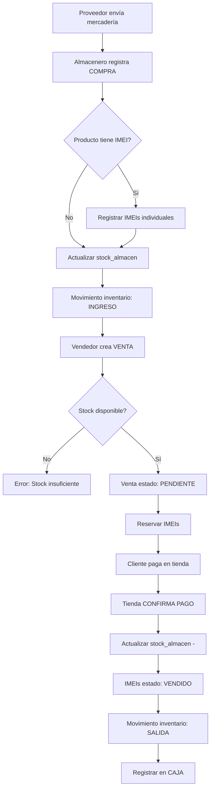
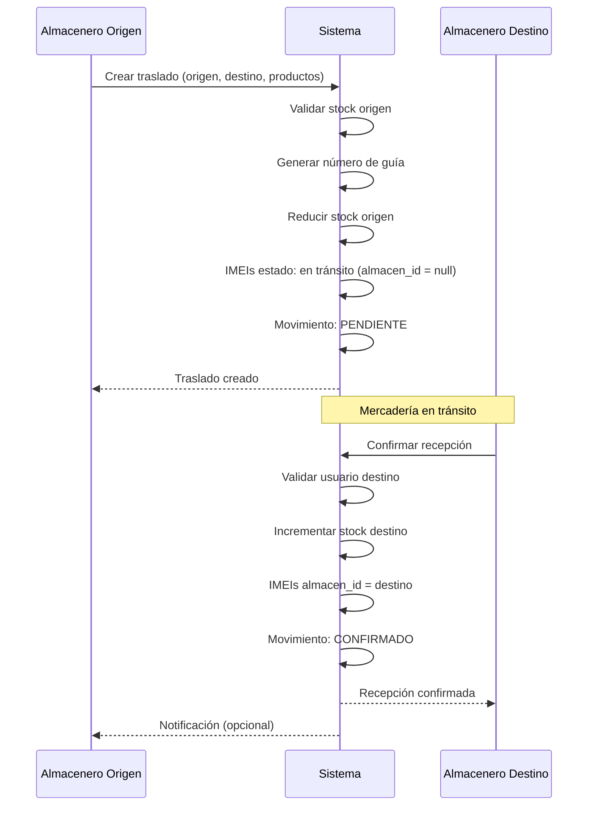

# Plan de Implementación: Sistema de Gestión de Importaciones

## Objetivo

Completar los módulos pendientes del sistema de importaciones: Proveedores, Pedidos, Compras, Ventas, Clientes, Traslados con guías y Caja, respetando la estructura existente y minimizando cambios fuertes en migraciones.

***

## Diagnóstico de Inconsistencias Detectadas

### 🔴 Críticas (Requieren atención inmediata)

1. **Duplicación de stock**: Existe `productos.stock_actual` (campo global) y `stock_almacen.cantidad` (por almacén). **Solución**: Eliminar o deprecar `stock_actual` en productos, usar solo `stock_almacen`.
2. **IMEI sin relación a movimientos de compra**: No hay forma de saber cuándo ingresó un IMEI al sistema (faltan campos `compra_id` o `fecha_ingreso`).
3. **Falta documento en traslados**: La guía de remisión no está contemplada en `movimientos_inventario`.
4. **Precio de venta único**: No hay precios diferenciados por sucursal/almacén (puede ser problema si los precios varían).

### 🟡 Menores (Mejoras recomendadas)

1. **Estado de productos múltiples**: El enum 'estado' en productos no contempla 'en tránsito' (útil para traslados).
2. **Sin auditoria en roles**: No hay `created_at`/`updated_at` en tabla `roles`.
3. **Falta campo observaciones**: Útil en compras, ventas y traslados para notas operativas.

***

## Estructura de Controladores y Servicios Propuesta

### Arquitectura de Capas

```
┌─────────────────────────────────────────────────────┐
│              BLADE VIEWS (UI Layer)                 │
├─────────────────────────────────────────────────────┤
│           CONTROLLERS (HTTP Layer)                  │
│  - Validación de requests                           │
│  - Autorización de roles                            │
│  - Delegación a servicios                           │
│  - Respuesta HTTP/JSON                              │
├─────────────────────────────────────────────────────┤
│             SERVICES (Business Logic)               │
│  - Lógica de negocio compleja                       │
│  - Coordinación entre modelos                       │
│  - Transacciones DB                                 │
│  - Validaciones de negocio                          │
├─────────────────────────────────────────────────────┤
│          MODELS (Data Access Layer)                 │
│  - Eloquent ORM                                     │
│  - Relaciones                                       │
│  - Scopes y Casts                                   │
└─────────────────────────────────────────────────────┘
```

### Servicios a Crear

```
app/Services/
├── CompraService.php          → Registrar compras, actualizar stock
├── VentaService.php           → Procesar ventas, validar stock/IMEI
├── TrasladoService.php        → Crear traslados, generar guías, confirmar recepción
├── StockService.php           → Centralizar operaciones de inventario
├── ImeiService.php            → Asignar/liberar IMEIs, validaciones
├── CajaService.php            → Apertura/cierre caja, registrar movimientos
└── SunatService.php           → Consultar RUC/DNI (integración API)
```

### Controladores a Crear

```
app/Http/Controllers/
├── ProveedorController.php    → CRUD + consulta SUNAT
├── PedidoController.php       → CRUD pedidos, cambiar estado
├── CompraController.php       → Registrar compras, detalle, IMEIs
├── ClienteController.php      → CRUD + consulta DNI/RUC
├── VentaController.php        → Crear ventas, confirmar pago
├── TrasladoController.php     → Crear/confirmar traslados, gestionar guías
└── CajaController.php         → Apertura, cierre, movimientos
```

***

## Fases de Implementación

### **FASE 1: Fundamentos (Proveedores, Clientes, Pedidos)**

#### 1.1 Migraciones

**Crear:**

* `create_proveedores_table`

* `create_clientes_table`

* `create_pedidos_table`

* `create_detalle_pedidos_table`

**Modificar:**

* Agregar `compra_id` a `imeis` (nullable, para rastrear origen)

* Agregar `numero_guia` y `observaciones` a `movimientos_inventario`

#### 1.2 Modelos

**Crear:**

* `Proveedor.php` (relaciones: compras, pedidos)

* `Cliente.php` (relaciones: ventas)

* `Pedido.php` (relaciones: proveedor, user, detalles)

* `DetallePedido.php`

#### 1.3 Seeders

* Proveedores de ejemplo (2-3 registros)

* Clientes genéricos (cliente mostrador)

#### 1.4 Controladores y Vistas

* `ProveedorController` (CRUD + método `consultarSunat()`)

* `ClienteController` (CRUD + validación DNI/RUC)

* `PedidoController` (crear, listar, cambiar estado)

* Vistas Blade básicas con Tailwind/Bootstrap existente

#### 1.5 Servicio SUNAT

* `SunatService::consultarRuc($ruc)` → retorna datos del proveedor

* Implementar código proporcionado por tu empresa

* Manejo de errores y timeouts

**Validaciones Críticas:**

* RUC único (11 dígitos numéricos)

* DNI único (8 dígitos)

* Email válido y único por proveedor

* Estado de pedido: `pendiente → aprobado → recibido → cancelado`

***

### **FASE 2: Compras (Registro e Inventario)**

#### 2.1 Migraciones

**Crear:**

* `create_compras_table`

* `create_detalle_compras_table`

**Modificar:**

* Agregar `compra_id` a `imeis` si no se hizo en Fase 1

#### 2.2 Modelos

* `Compra.php` (relaciones: proveedor, almacén, detalles, user)

* `DetalleCompra.php` (relación: producto, compra)

#### 2.3 Servicio de Compras

**`CompraService`:**

```php
- registrarCompra($data, $detalles): Compra
  ├─ Validar proveedor activo
  ├─ DB::transaction {
  │   ├─ Crear compra
  │   ├─ Crear detalles
  │   ├─ Actualizar stock_almacen (+cantidad)
  │   ├─ Si producto es 'celular': registrar IMEIs
  │   └─ Crear movimiento_inventario tipo 'ingreso'
  └─ Retornar compra
```

#### 2.4 Controlador y Vistas

* `CompraController` (create, store, index, show)

* Vista de formulario:

  * Seleccionar proveedor (con botón consultar SUNAT)

  * Número de factura

  * Almacén destino

  * Detalle dinámico (productos + cantidades + precios)

  * Si producto es celular: modal para ingresar IMEIs individuales

#### 2.5 Validaciones Críticas

* Validar que `producto_id` exista y esté activo

* Si `tipo_producto = 'celular'`: cantidad = número de IMEIs únicos ingresados

* `precio_unitario > 0`

* `almacen_id` debe ser tipo 'central' o 'sucursal'

* Número de factura único por proveedor

* Stock no puede ser negativo después de operación

***

### **FASE 3: Ventas (Registro y Confirmación de Pago)**

#### 3.1 Migraciones

**Crear:**

* `create_ventas_table`

* `create_detalle_ventas_table`

#### 3.2 Modelos

* `Venta.php` (relaciones: cliente, almacén, detalles, user)

* `DetalleVenta.php` (relaciones: venta, producto, imei)

#### 3.3 Servicio de Ventas

**`VentaService`:**

```php
- crearVenta($data, $detalles): Venta
  ├─ Validar stock disponible en almacén
  ├─ Si producto tiene IMEI: validar disponibilidad
  ├─ DB::transaction {
  │   ├─ Crear venta (estado_pago: 'pendiente')
  │   ├─ Crear detalles
  │   ├─ Reservar IMEIs (estado: 'reservado')
  │   └─ NO actualizar stock aún
  └─ Retornar venta

- confirmarPago($venta_id, $metodo_pago): void
  ├─ DB::transaction {
  │   ├─ Actualizar venta (estado_pago: 'pagado')
  │   ├─ Actualizar stock_almacen (-cantidad)
  │   ├─ Cambiar IMEIs a 'vendido'
  │   └─ Crear movimiento_inventario tipo 'salida'
  └─ Notificar vendedor (opcional: email/SMS)
```

#### 3.4 Controladores y Vistas

* `VentaController`:

  * `create()` → formulario (roles: Vendedor, Tienda)

  * `store()` → guarda venta pendiente

  * `confirmarPago()` → solo rol Tienda/Admin

  * `index()` → listar ventas por usuario/almacén

* Vistas:

  * Formulario de venta con búsqueda de productos

  * Si celular: seleccionar IMEI específico de lista disponible

  * Vista de confirmación de pago (botón para Tienda)

#### 3.5 Validaciones Críticas

* Stock disponible ≥ cantidad vendida

* IMEI debe estar en `estado = 'disponible'` y `almacen_id` correcto

* Precio venta > 0

* No permitir confirmar pago dos veces

* Vendedor solo puede ver sus propias ventas (excepto Admin/Tienda)

* Cliente puede ser `null` (venta mostrador) o existente

***

### **FASE 4: Traslados con Guías de Remisión**

#### 4.1 Modificar Migración Existente

**`movimientos_inventario`:**

* Agregar campos:

  * `numero_guia` (string, nullable)

  * `transportista` (string, nullable)

  * `fecha_traslado` (date, nullable)

  * `fecha_recepcion` (date, nullable)

  * `usuario_confirma_id` (foreignId, nullable → users)

#### 4.2 Servicio de Traslados

**`TrasladoService`:**

```php
- crearTraslado($data, $productos): MovimientoInventario
  ├─ Validar stock en almacén origen
  ├─ Generar número de guía correlativo
  ├─ DB::transaction {
  │   ├─ Crear movimiento tipo 'transferencia' (estado: 'pendiente')
  │   ├─ Reducir stock en almacén origen
  │   └─ Si producto tiene IMEI: cambiar almacen_id del IMEI a null (en tránsito)
  └─ Retornar movimiento

- confirmarRecepcion($movimiento_id, $user_id): void
  ├─ Validar que user pertenece a almacén destino
  ├─ DB::transaction {
  │   ├─ Actualizar movimiento (estado: 'confirmado', fecha_recepcion: now(), usuario_confirma_id)
  │   ├─ Incrementar stock en almacén destino
  │   └─ Si IMEI: actualizar almacen_id al destino
  └─ Notificar almacén origen
```

#### 4.3 Controlador y Vistas

* `TrasladoController`:

  * `create()` → formulario (origen, destino, productos, guía)

  * `store()` → delega a TrasladoService

  * `pendientes()` → lista traslados pendientes de confirmar

  * `confirmar($id)` → confirma recepción

* Vistas:

  * Formulario de traslado con validación de stock

  * Lista de traslados pendientes (filtrar por almacén destino del usuario logueado)

  * Botón "Confirmar Recepción" visible solo para usuario del almacén destino

#### 4.4 Validaciones Críticas

* `almacen_origen ≠ almacen_destino`

* Stock disponible en origen ≥ cantidad

* Número de guía único

* Solo usuario del almacén destino puede confirmar

* No permitir confirmar dos veces

* Al confirmar, validar que IMEIs existan y no estén vendidos

***

### **FASE 5: Caja (Apertura, Cierre y Movimientos)**

#### 5.1 Migraciones

**Crear:**

* `create_caja_table`

* `create_movimientos_caja_table`

**Campos clave:**

* `caja`: `user_id`, `almacen_id`, `fecha`, `monto_inicial`, `monto_final`, `estado` (abierta/cerrada)

* `movimientos_caja`: `caja_id`, `venta_id`, `compra_id`, `tipo` (ingreso/egreso), `monto`, `concepto`

#### 5.2 Modelos

* `Caja.php` (relaciones: user, almacén, movimientos)

* `MovimientoCaja.php` (relaciones: caja, venta, compra)

#### 5.3 Servicio de Caja

**`CajaService`:**

```php
- abrirCaja($user_id, $almacen_id, $monto_inicial): Caja
  ├─ Validar que no hay caja abierta del usuario
  ├─ Crear registro caja (estado: 'abierta')

- registrarMovimiento($caja_id, $tipo, $monto, $referencia): void
  ├─ Crear movimiento_caja
  └─ Actualizar monto_final de caja

- cerrarCaja($caja_id, $monto_final_real): void
  ├─ Calcular diferencia (monto_final_calculado vs real)
  ├─ Actualizar caja (estado: 'cerrada', monto_final)
  └─ Generar reporte de cierre
```

#### 5.4 Controlador y Vistas

* `CajaController`:

  * `abrir()` → formulario de apertura

  * `store()` → abre caja

  * `actual()` → muestra caja activa del usuario

  * `cerrar()` → cierra caja con cuadre

  * `movimientos()` → lista movimientos de la caja actual

* Vistas:

  * Apertura de caja (monto inicial)

  * Dashboard de caja (ingresos/egresos del día)

  * Cierre de caja con resumen

#### 5.5 Integración con Ventas

**Al confirmar pago de venta:**

* Llamar `CajaService::registrarMovimiento()` automáticamente

* Tipo: 'ingreso'

* Monto: total de venta

* Referencia: `venta_id`

#### 5.6 Validaciones Críticas

* Usuario solo puede tener una caja abierta por almacén

* Monto inicial ≥ 0

* No permitir cerrar caja si hay ventas pendientes de confirmación

* Registro de diferencias (faltante/sobrante) en cierre

***

## Validaciones Críticas Globales

### Por Módulo

#### **Proveedores**

* RUC: 11 dígitos, único, validado con SUNAT

* Email: formato válido, único

* Estado: solo proveedores activos en selects

#### **Compras**

* Factura única por proveedor

* Precio unitario > 0

* Si celular: cantidad = número de IMEIs ingresados

* IMEI: 15 dígitos, único globalmente

#### **Ventas**

* Stock disponible antes de crear venta

* IMEI reservado no puede venderse dos veces

* Total venta = suma (precio\_unitario \* cantidad)

* Estado pago: pendiente → pagado (irreversible)

#### **Traslados**

* Origen ≠ Destino

* Stock suficiente en origen

* Guía única y obligatoria

* Solo usuario del destino confirma recepción

#### **Caja**

* Una caja abierta por usuario/almacén

* Movimientos solo en caja abierta

* Cierre requiere cuadre manual

### Validaciones de Seguridad

* Middleware de roles en todas las rutas críticas

* CSRF token en formularios

* Sanitización de inputs (usar Request Form Validations)

* Logs de auditoría en operaciones críticas (compras, ventas, traslados, caja)

***

## Flujo de Datos Críticos

### Diagrama: Flujo de Compra a Venta



### Diagrama: Flujo de Traslado con Confirmación



***

## Estructura de Archivos a Crear/Modificar

### Nuevas Migraciones (8)

```
database/migrations/
├── *_create_proveedores_table.php
├── *_create_clientes_table.php
├── *_create_pedidos_table.php
├── *_create_detalle_pedidos_table.php
├── *_create_compras_table.php
├── *_create_detalle_compras_table.php
├── *_create_ventas_table.php
├── *_create_detalle_ventas_table.php
├── *_create_caja_table.php
├── *_create_movimientos_caja_table.php
└── *_add_guia_fields_to_movimientos_inventario.php
```

### Modificaciones

```
database/migrations/
└── (nueva) *_add_compra_id_to_imeis.php
```

### Modelos (10)

```
app/Models/
├── Proveedor.php
├── Cliente.php
├── Pedido.php
├── DetallePedido.php
├── Compra.php
├── DetalleCompra.php
├── Venta.php
├── DetalleVenta.php
├── Caja.php
└── MovimientoCaja.php
```

### Servicios (7)

```
app/Services/
├── SunatService.php
├── CompraService.php
├── VentaService.php
├── TrasladoService.php
├── StockService.php
├── ImeiService.php
└── CajaService.php
```

### Controladores (7)

```
app/Http/Controllers/
├── ProveedorController.php
├── ClienteController.php
├── PedidoController.php
├── CompraController.php
├── VentaController.php
├── TrasladoController.php
└── CajaController.php
```

### Vistas (\~25 archivos Blade)

```
resources/views/
├── proveedores/
│   ├── index.blade.php
│   ├── create.blade.php
│   └── show.blade.php
├── clientes/
│   ├── index.blade.php
│   └── create.blade.php
├── pedidos/
│   ├── index.blade.php
│   ├── create.blade.php
│   └── show.blade.php
├── compras/
│   ├── index.blade.php
│   ├── create.blade.php
│   └── show.blade.php
├── ventas/
│   ├── index.blade.php
│   ├── create.blade.php
│   ├── show.blade.php
│   └── confirmar-pago.blade.php
├── traslados/
│   ├── index.blade.php
│   ├── create.blade.php
│   ├── pendientes.blade.php
│   └── show.blade.php
└── caja/
    ├── abrir.blade.php
    ├── actual.blade.php
    └── cerrar.blade.php
```

### Rutas (routes/web.php)

* Agregar 7 grupos de rutas resource + rutas custom

***

## Orden de Implementación Recomendado

### Secuencia de Dependencias

```
1. Proveedores + Clientes + SUNAT Service
   ↓
2. Pedidos (depende de Proveedores)
   ↓
3. Compras (depende de Proveedores + StockService + ImeiService)
   ↓
4. Ventas (depende de Clientes + StockService + ImeiService)
   ↓
5. Traslados (depende de StockService + ImeiService)
   ↓
6. Caja (depende de Ventas)
```

***

## Criterios de Aceptación (Definition of Done)

### Por Fase

#### Fase 1: Proveedores/Clientes/Pedidos

* [ ] CRUD completo de proveedores funcional

* [ ] Consulta SUNAT retorna datos correctos

* [ ] CRUD de clientes con validación DNI/RUC

* [ ] Pedidos se crean y cambian de estado

* [ ] Dashboard de proveedor muestra sus pedidos

* [ ] Validaciones de unicidad funcionan

#### Fase 2: Compras

* [ ] Registro de compra actualiza `stock_almacen`

* [ ] Productos celulares registran IMEIs únicos

* [ ] Movimiento de inventario tipo 'ingreso' se crea automáticamente

* [ ] Factura única por proveedor validada

* [ ] Vista de compra muestra detalle completo

#### Fase 3: Ventas

* [ ] Venta se crea con estado 'pendiente'

* [ ] IMEIs se reservan correctamente

* [ ] Confirmación de pago actualiza stock y cambia IMEI a 'vendido'

* [ ] Validación de stock previene sobreventa

* [ ] Vendedor solo ve sus ventas

* [ ] Tienda puede confirmar pagos

#### Fase 4: Traslados

* [ ] Traslado reduce stock origen y lo deja pendiente

* [ ] Número de guía se genera automáticamente

* [ ] IMEIs quedan en tránsito (almacen\_id = null)

* [ ] Solo usuario destino puede confirmar

* [ ] Confirmación incrementa stock destino

* [ ] No se puede confirmar dos veces

#### Fase 5: Caja

* [ ] Usuario puede abrir una caja por almacén

* [ ] Ventas confirmadas registran movimiento automático

* [ ] Cierre de caja calcula diferencia

* [ ] No se puede abrir segunda caja sin cerrar anterior

* [ ] Reporte de cierre muestra cuadre

***

## Trazabilidad: Paso → Archivos → Verificación

| Fase               | Archivos Clave                                                    | Verificación Manual                                                       |
| ------------------ | ----------------------------------------------------------------- | ------------------------------------------------------------------------- |
| **1. Proveedores** | `ProveedorController`, `SunatService`, `create_proveedores_table` | Consultar RUC desde formulario, verificar datos retornados                |
| **2. Compras**     | `CompraService`, `CompraController`, `create_compras_table`       | Registrar compra con celular, verificar IMEIs en BD y stock incrementado  |
| **3. Ventas**      | `VentaService`, `VentaController`, `create_ventas_table`          | Crear venta pendiente, confirmar pago, verificar stock reducido           |
| **4. Traslados**   | `TrasladoService`, `TrasladoController`, migración modificada     | Crear traslado, verificar stock origen reducido, confirmar en destino     |
| **5. Caja**        | `CajaService`, `CajaController`, `create_caja_table`              | Abrir caja, confirmar venta, verificar movimiento registrado, cerrar caja |

***

## Notas Finales

### Sobre Cambios Estructurales Mínimos

* No se tocan migraciones existentes excepto para agregar campos (backwards compatible)

* Se respeta la estructura de controladores actual

* Las vistas seguirán el mismo patrón de `resources/views/inventario/`

### Sobre el Código SUNAT

* Al implementar `SunatService`, se revisará el código proporcionado por tu empresa

* Se implementará manejo de errores robusto (timeouts, RUC inválido, servicio caído)

* Se agregará caché opcional para evitar consultas repetidas

### Consideraciones de Testing

* Crear seeders de datos de prueba para cada módulo

* Probar flujos completos: Compra → Stock → Venta → Caja

* Validar permisos por rol en cada endpoint

***

## Resumen Ejecutivo

**Archivos a crear:** \~60 (migraciones, modelos, controladores, servicios, vistas)\
**Archivos a modificar:** \~5 (rutas, sidebar, migraciones existentes)\
**Complejidad crítica:** Servicios de Stock, IMEI y Traslados\
**Riesgo principal:** Inconsistencias de stock en operaciones concurrentes → usar transacciones DB\
**Dependencia externa:** API SUNAT (implementar con retry y fallback)

**Prioridad de implementación:**

1. Proveedores/Clientes (sin esto no hay compras/ventas)
2. Compras (alimenta inventario)
3. Ventas (salida de inventario)
4. Traslados (movimiento entre almacenes)
5. Caja (control financiero)

Este plan está diseñado para ejecutarse de forma incremental, permitiendo pruebas continuas y ajustes sobre la marcha.
